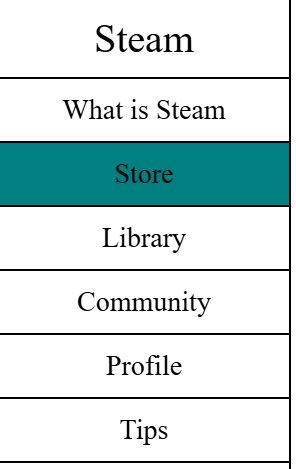
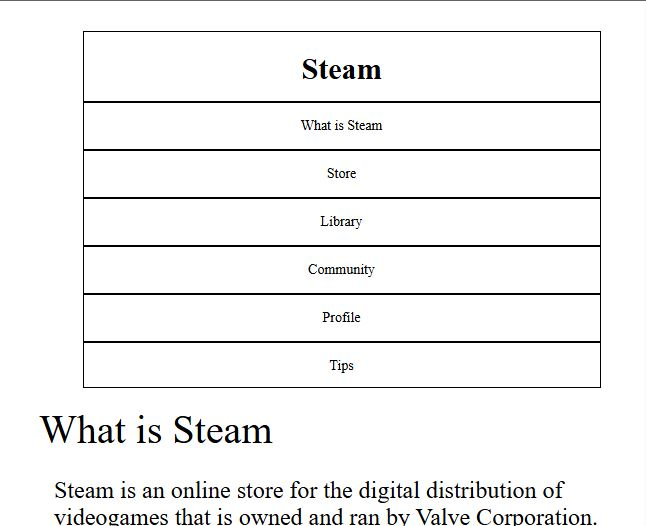
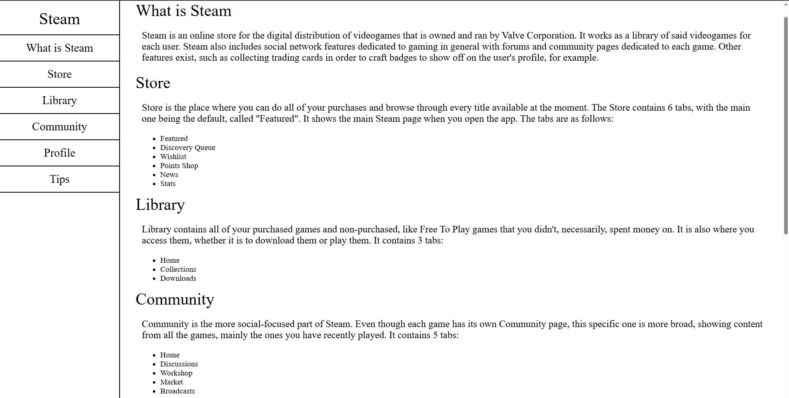
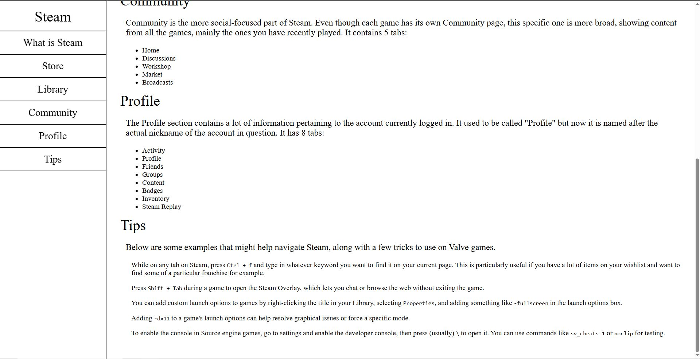
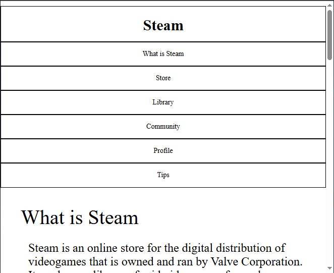
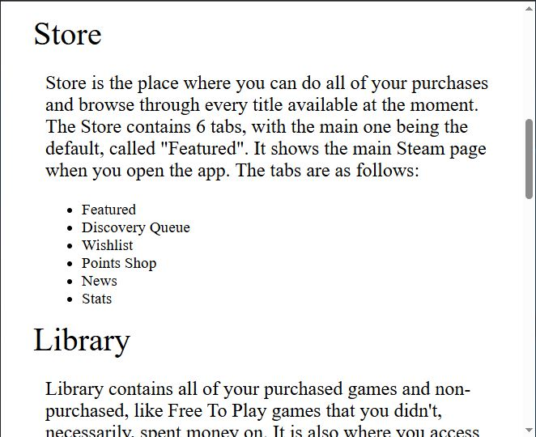

## Purpose
The purpose of this project was to make a technical documentation page.

The page should have a navbar on the left side and have its topics redirect to the appropriate position of the page when clicking on them. Or, in other words, when the user clicks "Home" on the navbar, for example, the page should show the "Home" section. The navbar should, as well, always stay on the left side of the page, even when scrolling up and down the main document. 

One thing I hadn't notice in the beginning of the project was that, when resizing the window of the example project, the navbar switched to the top of the page. I added this functionality later, when I noticed it, even though it wasn't one of the requirements. Having thought about it, since the use of a "@media" query was mandatory, this repositioning might actually have been a requirement.

## Process
For this project, and to try to keep some originality, I went for a document that would help a user navigate through the online digital videogames store called Steam. I'm not sure if this can be considered actually a technical documentation page, but I felt like, this way, it wouldn't be just a copy of the example project. Therefore, I could present something I'm familiar with and retain some originality, as I said before. 

Like the previous project "Tribute Page", initially I thought I would have a lot more text, with a deeper walkthrough, but, like before, that would just mean adding more text without any additional functionalities related to HTML or CSS, which is the point of these projects. I just showed an overall view of the various Steam tabs and added an extra section at the end called "Tips". I felt the need to add this section, because one of the requirements  was to have 5 "code" elements and this was the only way I thought of having them while maintaining the flow of the document.

### HTML
The way the page is presented is that it has 2 main sections. The first is the navbar (a "nav" element inside a "div" element) that contains the topics for each section of the document and clicking them positions the page on the section with the same name. I also added a little visual flourish when hovering each topic, so that the user knows that it is a clickable item, instead of just having to notice the mouse icon switching to the familiar "hand" pointer - there is a screenshot below showing this.

The second main section is a "main" element that contains the subsections corresponding to each topic of the navbar. I decided to have each of said topics correspond to the tabs of the Steam app on the desktop. With another requirement being "have at least 5 list items", I added a list to each of the topics that correspond to the subtabs relative to each tab of the app. Exampple -> The tab "Library" has 3 sections, therefore the list in "Library" has 3 entries, one for each of those sections. 

### CSS
Besides the color change when hovering over the topics, the visual aspect of the page is pretty basic. Clean, organized and functional aesthetic was prioritized, especially since this is supposed to be a technical document. The main aspect of the CSS on this project, though, is the use of a query. An "@media" query was used to reposition the navbar to the top when resizing the window below a certain size. While it is above said size, the navbar remains fixed to the left, regardless of the user scrolling up or down. When the window width goes below the threshold, the navbar goes to the top of the page, but does not remain fixed, if the user scrolls down, there goes the navbar. The redirection when clicking the topics remains funtional, which is useful to quickly go to the desired section without needing to scroll down.

There are also a few comments (on the HTML file as well) that relates to the (previous) use of a "div" element to separate each of the topics on the navbar. Each of these elements was just a solid line that worked like a border. It felt hardcoded, so I switched to using the natural border of each topic, named "nav-link". The resulting look was the same, but I decided to leave the unused code commented to show the train of thought and to remember that there are other solutions for the same purpose, even though some are not as efficient.

I also have to add that, initially, the navbar of the windowed version was a smaller rectangle that was positioned in the center of the page (see below). However, one requirement was that the navbar must stay on the left at all times, so stretching the rectangle from the left to the right was the solution, even though I prefered the smaller look, hence the screenshot that I took. If I had to show the project to a prospective client, that would be the better visual, in my opinion.

## Conclusions
I'm happy with the end result, moreso than the previous project. It is never perfect, but I think it fulfilled everything it was supposed to accomplish. I feel more comfortable dealing with HTML than CSS, but there are improvements. There was some struggle with the navbar but nothing serious and, obviously, nothing that couldn't be done. 

I was worried at first when I read on the requirements that I had to use "code" elements because I think that wasn't ever touched in the lessons before, but, to my understanding, it is just another way to present text, normally text related to code so that it stands out from normal text. 

Overall, I believe this to be quite presentable, not flawless, but definitely positive.

---
### Screenshots

